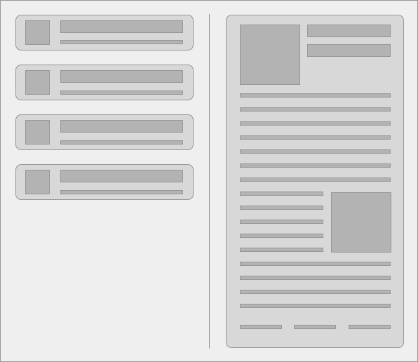

<p align="left">
  
</p>

## Coding Challenge

> ### ⚠️ Read it first!
> The purpose of this challenge is to give us an idea about your coding skills.
> At XHOCKWARE we value well structured and tested code. Semantic HTML, modern and responsive CSS, a consistent coding style and a structured code base are important to us.
> I know... you probably love to code (we also love it!). But please, read this file until the end and make sure you understand the requirements before you start coding! If you have any questions, just let us know!
> ### ⚠ Please do not share this challenge ! ⚠


### Challenge
Build a Javascript application that contains a list and a detail view of news articles.
The application should be built with two columns and behave like this:

- The left side with the list of news articles.
   * When you click on one of the articles in the list, the content is shown in the other section and that article is marked as read.
- The right side with a detailed view of the current active article, or an empty view if none is selected.

The final app should look somewhat similar to the mockup below, but as long as you meet the criteria described above, you can build it in whichever way you find appropriate.

<p align="center">
  
</p>

## Tech Requirements
### For Everyone
- Use Vue.JS to build this application (MANDATORY).
  * If you think it makes it easier for you, you can start with some Vue boilerplate (https://vue-community.org/guide/ecosystem/boilerplates.html).

  * (FALLBACK) If you don't know Vue.JS at this time (don't worry about it... we all keep learning new stuff every day), you can use React to build this application. Again, you can start with create-react-app(https://github.com/facebook/create-react-app).


- Please do the layout and styling with your own CSS (pre-processors are allowed). Don't use any component libraries like bootstrap or material-ui.

- Please try to implement a layout that shows emphasizes the relevant data points of each article(Title, picture, publish date, source, etc)

- Testing your code is important, we'd like to see some tests (full coverage not required).

- Use this README to document what you've built. Make sure that the person that reviews this code understands your choices and challenges:
  * **Use this readme to explicitly list and comment the features you decided to implement - we don't want to miss ou on anything...** - you can find the more advanced requirments identified as (Rn) bellow, to help you reference them in the readme
  * Outline your reasoning behind technical choices (architecture, third party libs, etc.)
  * Explain technical trade-offs
  * Anything you skipped due to time constraint?
  * What would you add if you had additional time for this project?
  
### Not challenging enough?

- (R1) Add a search functionality for the list view so we can reach certain articles easier. Search should filter the articles on the left side, and clear the panel on the right.

- (R2) We're showing too many articles on a single page. Implement pagination using client-side routing, so we only see 10 articles at a time.

- (R3) We like tidy code! Configure linting for your JavaScript and CSS files (you can use style guides like [Airbnb JavaScript Style Guide](https://github.com/airbnb/javascript)).

- (R4) Let's say we need our application to support IE11. To a reasonable extent, ensure we can support modern Javascript in not-so-modern browsers.

- (R5) We all know designers love animations, so try adding some CSS animations.

- Anything else you'd like to show us? :)

### Advanced Level
Do you feel this is too easy, and that you are way better than this?
We allways prefer people with advanced knowledge and that can provide value in broader range of compentences.

**Things we would like to see from an advanced developer**

- (R6) Use VueX to store your data - All requests should then be directed to VueX Store So that a data set is stored locally
- (R7) Change the "search" and "paging" feature to operate over the VueX stored data rather than over the API
- We use Framework7 ([framework7.io](https://framework7.io)) for many of our ongoing and legacy projects. Instead of doing your own Vanilla implementation, we would like to see you use framework 7 to implement this project.
 * (R8) at first you can use framework7 standard features to implement your project
 * (R9) but afterwards you should customize the look and feel of the list to better enhance the looks of the article list column to highlight the key data points
- (R10) You should use media queries or other style sheet features to assure correct rendering on both mobile and desktop


## Basic Tooling & API

To get you started in the right direction, we give you a couple of yarn scripts. But feel free to improve and extend it as you go through the assignment.

```sh
> cd api
> yarn install
> yarn api       # run API on 0.0.0.0:8000
```

The API serves the endpoint you'll need:

```sh
/v1/news?q=      # get the list of articles
```

Or if you want to use GraphQL

```sh
query GetNewsArticles($title: String){
  articles(title: $title) {
    author
    title
    description
    url
    urlToImage
    publishedAt
    content
  }
}
```

It is not mandatory to run with this server or to use this API, but we highly recommend it. If you really want to use another API, please give a good reason in the [Development Journal](#development-journal) section. If you feel the need to change the API or add something, feel free to do so.

> The data was obtained through newsapi.org


### Submiting your code

To submit this challenge please do as instructed

1. Start by clonning this project your own GitHub account - **this is important because it establishes when you started working on this...**
2. Submit your final code as the lattest commit to the Master Branch.
3. Add 'joaopasrodrigues' as a colaborator on the project and set it as private
3. Let us know about it by sending us an e-mail with the URL to [tech@xhockware.com](mailto:tech@xhockware.com)

> ** ⚠️ PLEASE MAKE SURE THIS PROJECT ON GITHUB IS NOT PUBLICLY VISIBLE. **


Feel free to use different branches if you want to show different version - but make sure you let us know which ones you want us to look at...


### Notes

- The total working time should be around 6 hours. Focus on completing the [Tech Requirements](#tech-requirements) first and only then move to the [Not challenging enough?](#not-challenging-enough) and [ Advanced Level](#advanced-Level) sections. This lasts sections is not mandatory, but with that done we can get more information on your coding skills.

- We'd like to see how familiar you're with Vue.JS and its features, but if you think you'll need another framework please explain shortly in the documentation section.

- In general, we'd rather see something simple you understand than something fancy you can't explain.

- Please don't use something you already developed.

- if you have any questions feel free to get in touch to [tech@xhockware.com](mailto:tech@xhockware.com) - we will try our best to get reply quickly

Happy coding & good luck! 🚀

---
## Development Journal

###### PT-br version

De acordo com o que interpretei no README da API, objetivo principal da aplicação é realizar um request para a API disponibilizada, onde retornará uma lista com diversos artigos. Esta lista deve ser apresentada para o usuário, que poderá ler os detalhes do artigo clicando no botão 'Read more' do card correspondente. 

A ideia inicial foi que a aplicação fosse simples e fácil de usar, sem "features" desnecessárias dentro do tempo disponível para o desenvolvimento. Levando isso em consideração, alguma coisas como cores e tipografia foram mantidas já que possuem um impacto leve porém com contraste entre o background e os textos.

O fluxo comum de utilização da aplicação seria:
1 - Acessar a aplicação;
2 - O request para a API é feito e uma animação de loading aparece na seção da esquerda até que a requisição esteja completa e a lista de artigos tenha sido salva no estado da aplicação.
3 - Caso ocorra um erro na requisição, o componente de empty section é chamado e renderiza um emoji e uma mensagem;
4 - Caso tudo ocorra bem com a requisição, a lista é renderizada e a seção da direita permanece em branco, apenas com a animação de 'emoji' com expressão neutra, e uma mensagem informativa guiando o usuário a clicar em um dos artigos.
5 - Ao clicar no artigo, este deve ser salvo no estado da aplicação como currentArticle e então o componente ArticleDetail é renderizado com as informações do artigo.
6 - Se o usuário buscar por outro artigo através do search filter, o valor de currentArticle é definido novamente como null para que a seção da direita fique em branco até que outro artigo seja selecionado, conforme solicitado no README do desafio.

### Como rodar

- Inicialmente é preciso que a API esteja rodando localmente para receber os requests da aplicação:
    cd api -> yarn install -> yarn api
- Em outro terminal, acessar o diretório correspondente à aplicação:
    cd app -> npm install -> npm run serve

### Processo de desenvolvimento

Para iniciar o desenvolvimento do projeto, incialmente tentei fazer um levantamento de todos os requisitos obrigatórios que consegui encontrar no README do projeto e criei um checklist com isso, dessa forma pude organizar melhor minhas tomadas de decições e quebrar algumas tarefas em pedaços menores e mais simples. 

Nesse processo comecei realizando um scketch manual de como o layout da aplicação poderia ficar, e então criei um Moadboard simples apenas para salvar e usar como referência imagens de outros projetos de contexto similar a este. Também decidi usar SASS por ser o pré processador com o qual mais trabalhei e conheço.

Como gosto bastante de fazer animações em CSS, pesquisei por referências em sites como o CodePen para utilizar a animação de 'emoji' que aparece no componente de seção vazia. Também tentei manter o aplicativo responsável o máximo possível durante o tempo do desafio.

Apesar de a requisição sempre ser realizada quando a página é aberta, foi adicionado um botão para realizar o refresh da lista caso o usuário deseje. 

Além disso, é possível realizar uma busca pelo títutlo dos artigos através do search filter que está logo no início da seção da esquerda (em cima da lista de artigos).

Escolhi realizar o teste com Vue pela afinidade que venho construindo com o framework e também porque faz parte da stack solicitada pela Xhocware. 

Como desenvolvi a aplicação em Vue 3 e estou acostumada a trabalhar com a versão 2, algumas coisas foram diferentes de manipular, como por exemplo o setup de testes. Tentei utilizar o test-utils porém tive problemas na trativa do Vuex. Devido ao tempo para a entrega do desafio, decidi seguir com a entrega sem os testes a princípio, mas continuo tentando realizar a configuração aqui para entender como resolver o problema e posso atualizar o repositório futuramente :). De forma geral, não houveram outros grandes impedimentos durante o desenvolvimento.

### Melhorias que gostaria de fazer

- Conforme citado no README, gostaria de adicionar paginação à lista de artigos principalmente em função do número total de artigos armazenados;
- Adicionar os testes para os seguintes pontos;
    - Quando alterar o valor do input de pesquisa, o current article deve ser null
    - Quando clicar no Read More, o current article deve ser diferente de null
    - Quando preencher um valor no input, o número de cards na tela deve ser igual ao filteredList length
- Avaliar com mais tempo as otimizações possíveis nas lógicas desenvolvidas dentro da aplicação;
- Avaliar com mais tempo uma forma de organizar o app para deixar mais modular partes que poderiam ser reutilizadas caso a aplicação tivesse o objetivo de escalar;
- Mover a função que busca os artigos para o arquivo de ArticlesList;

--- 

###### EN version

According to what I interpreted in the API README, the application's main objective is to make a request to the available API, which will return a list with several articles. This list must be presented to the user, which will be able to read the article details by clicking on the 'Read more' button on the corresponding card.

The initial idea was for the application to be simple and easy to use, without unnecessary "features" within the time available for development. With that in mind, some things like colors and typography were kept, as they have a gentle impact but with contrast between the background and the texts.

The common flow for using the application would be: 1 - Access the application; 2 - The request to the API is made and a loading animation appears in the left section until the request is complete and the list of articles has been saved in the application state. 3 - If an error occurs in the request, the empty section component is called and renders an emoji and a message; 4 - If everything goes well with the request, the list is rendered and the right section remains blank, only with the 'emoji' animation with neutral expression, and an informative message guiding the user to click on one of the articles. 5 - When clicking on the article, it must be saved in the application state as currentArticle and then the ArticleDetail component is rendered with the article information. 6 - If the user searches for another article through the search filter, the value of currentArticle is set back to null so the right section is blank until another article is selected, as requested in the README of the challenge.

### How to run

- Initially, the API must be running locally to receive requests from the application: cd api -> yarn install -> yarn api
- In another terminal, access the directory corresponding to the application: cd app -> npm install -> npm run serve

### Development process

To start the development of the project, I initially tried to survey all the mandatory requirements that I could find in the project's README and created a checklist with it, in this way I could better organize my decision making and break some tasks into smaller and simpler pieces.

In this process I started by making a manual sketch of how the application's layout could look, and then I created a simple Moadboard just to save and use as a reference images from other projects with a similar context. I also decided to use SASS because it's the preprocessor I've worked with and know the most.

As I really like making animations in CSS, I searched for references on sites like CodePen to use the 'emoji' animation that appears in the empty section component. I also tried to keep the app responsive as possible during the challenge time.

Although the request is always performed when the page is opened, a button was added to refresh the list if the user wants to.

In addition, it is possible to perform a search by the title of the articles through the search filter that is at the beginning of the left section (above the list of articles).

I chose to do the challenge with Vue because of the affinity I've been building with the framework and also because it's part of the stack requested by Xhockware.

As I developed the application in Vue 3 and I'm used to working with version 2, some things were different to handle, such as the test setup. I tried to use test-utils but have problems to work with the Vuex state. Due to the time for the challenge delivery, I decided to go ahead with the delivery without the tests at first, but I'm still trying to perform the configuration here to understand how to solve the problem and I can update the repository in the future :). Overall, there were no other major impediments during development.

### Improvements I would like to make if I had more time

- As mentioned in the README, I would like to add pagination to the article list, mainly due to the total number of articles stored;
- Add tests for the following points;
  - When changing the search input value, the current article must be null
  - When clicking on Read More, the current article must be different from null
  - When filling a value in the input, the number of cards on the screen must be equal to the filteredList length;
- Evaluate with more time the possible optimizations in the logics developed within the application;
- Evaluate with more time a way to organize the app to make parts more modular that could be reused if the application had the objective of scaling;
- Move the function that fetches the articles to the ArticlesList file;

[Original app repository](https://github.com/carolineignr/list-articles)
 -  You can see all original commits here

[Simple moadboard to help guide on article stylish](https://caroline555183.invisionapp.com/board/5U8051138CXPNAF)
 - Articles web designs references
